# UFCE Agent

UFCE Agent now contains the completed Part II bank conversational UFCE MVP after Phase 3.2. The current system is a bank-only end-to-end local product that uses a local LM Studio hosted model as a strict structured parser, then hands control to a deterministic backend for validation, conversation-state control, runtime execution, invariant validation, explanation rendering, API delivery, UI interaction, session persistence, and per-turn artifact logging.

The LLM is a structured extraction layer only. It does not generate counterfactuals. The deterministic backend remains the authority for the bank-only conversational runtime.

## Final Thesis Quickstart

Minimal flow for reviewers:

```bash
cp .env.example .env
python -m venv .venv
. .venv/bin/activate
pip install -r requirements.txt

# Check environment (recommended)
python scripts/final/thesis/doctor.py

# Part I: UFCE core evidence
python scripts/final/part1/99_part1_closeout.py --out-dir outputs/final/part1_closeout

# Part II: Conversational evidence (requires LM Studio running)
python scripts/final/part2/99_part2_closeout.py --out-dir outputs/final/part2_closeout

# Product demo server (optional, for evaluator demonstration)
python scripts/final/product/01_serve_demo.py
```

For full instructions and advanced options see `docs/FINAL_RUNBOOK.md`.

## Development and Historical Workflows

Historical phase commands are documented in:
- `docs/DEVELOPMENT_HISTORY.md` (evolution of the project)
- `docs/FINAL_SCRIPT_INVENTORY.md` (scripts with their role in final evidence)

Important note for reviewers:
- The repository does not include heavy generated artifacts. All production outputs must be regenerated via the official final scripts above; `.gitignore` intentionally excludes runtime-generated data.
- If you need to inspect existing historical results, they are located under `outputs/`. Do not modify them as part of evidence generation.

## Project Status

- `Phase 1`: complete as a thesis-safe bank conversational backend MVP
- `Phase 2`: complete with accepted evidence-pack generation and thesis chapter assets
- `Phase 3.1`: complete with explicit conversation request builder and negotiation controller
- `Phase 3.2`: complete as a local bank-only product MVP with API, UI, persistence, artifact access, and runtime hardening

Current project position:

- The repository now contains a fulfilled bank-only end-to-end conversational UFCE architecture, not just a backend prototype.
- The implemented product is strong enough for evaluator demos, repeated internal review, and controlled local use.
- The codebase remains intentionally narrow: bank is the only supported live conversational dataset, while other dataset bundles are exposed only as informational catalog entries.

## Results So Far

Architecture and product completion after Phase 3.2:

- strict parser contract and one-step repair boundary are implemented
- canonical validator, conversation request builder, and negotiation controller are implemented
- deterministic bank runtime orchestration, invariant validation, and explanation rendering are implemented
- FastAPI `/api/v1`, server-rendered browser UI, SQLite session persistence, and filesystem artifact browsing are implemented
- stable demo runtime mode, runtime debug tracing, manifest-constrained artifact downloads, and safe inline artifact preview are implemented

Latest verified results from the completed implementation cycle:

- `llm/tests`: `133 passed`
- `llm_eval/tests`: `11 passed`
- Phase 3.1 formal closeout: `9/9` live scenarios passed and `ready_to_start_phase3_2 = true`

Evidence roots used for the current status:

- Phase 3.1 formal closeout:
  - `outputs/phase3_1_closeout/phase3_1_closeout_20260321T144502Z/phase3_1_standalone_report.md`
  - `outputs/phase3_1_closeout/phase3_1_closeout_20260321T144502Z/phase3_1_closeout_summary.md`
  - `outputs/phase3_1_closeout/phase3_1_closeout_20260321T144502Z/phase3_1_closeout_summary.json`
- Phase 3.2 product evidence:
  - `outputs/phase3_2_product/sessions.sqlite3`
  - `outputs/phase3_2_product/artifacts/`

Important evidence boundary:

- Phase 3.1 has a checked formal closeout report in the repository.
- Phase 3.2 now has a dedicated acceptance runner at `scripts/run_phase3_2_acceptance_report.py`.
- A new post-change manual UI session still needs to be recorded and passed into the acceptance runner before the final evaluator-facing acceptance verdict should be treated as complete.

## Phase 3.2 Product Status

The Phase 3.2 MVP surface now includes:

- FastAPI JSON API under `/api/v1`
- server-rendered browser UI for interactive sessions
- SQLite-backed session and turn persistence
- filesystem-backed artifact browsing and manifest-constrained downloads
- safe inline preview for manifest-listed `.json`, `.txt`, and `.md` artifacts
- `stable_demo` runtime mode with reproducibility tracing
- deterministic post-runtime invariant validation
- session archive and read-only mode
- dataset catalog page and API for available UFCE bundles
- in-page chat updates without forced full-page reload after message submission
- latest-first scrollable chat history panel
- deterministic bank follow-up extraction to recover short clarification replies when the parser underfills them
- bounded clarification with a hard cap of `3` clarification-bound turns
- terminal case completion state with restart-required handling
- optional bank-only `constraint_spec` v1 as post-UFCE deterministic filtering, ranking, and gating

This is complete for the local MVP scope. It is not positioned as a cloud-ready, multi-dataset, enterprise deployment.

## Implemented Architecture

Current frozen contracts:

- Parser output: `{"task","status","cf_request","missing_fields","conflicts","notes","constraint_spec?"}`
- Runtime input: `{"dataset":"bank","profile":{...},"constraint_spec?"}`
- Public conversation stages: `NEEDS_CLARIFICATION`, `CONFLICT`, `UNSUPPORTED_REQUEST`, `RUNTIME_SUCCESS`, `RUNTIME_REJECT`, `PARSER_FAILURE`
- Internal-only controller state: `READY_FOR_RUNTIME`
- Case completion taxonomy: `runtime_success`, `runtime_reject`, `conflict`, `unsupported_request`, `clarification_limit_reached`, `parser_failure`

```mermaid
flowchart LR
    A[User, CLI, or UI Input] --> B[Bank Conversation Orchestrator]
    B --> C[Live LM Studio Parser]
    C --> D[Normalize and Schema Validate]
    D -- Invalid or repairable output --> R[One-Step Repair]
    R --> D
    D --> E[Canonical Bank Validator]
    E --> F[Conversation Request Builder and Negotiation Controller]
    F -- Clarify, conflict, unsupported --> K[Artifact Writer and Session Persistence]
    F -- Ready for runtime --> G[Runtime Orchestrator<br/>bank only]
    G --> H[Prediction Service]
    H -- Desired outcome already reached --> I[Deterministic Explanation]
    H -- Negative prediction --> J[UFCE Candidate Search]
    J --> V[Invariant Validator]
    V -- Valid CF or no CF needed --> I
    V -- Invalid CF blocked --> I
    I --> K
    K --> P[FastAPI API + SSR UI + SQLite]
```



Architecture notes:

- The parser is called through LM Studio chat completions with strict `json_schema` output and fixed parse or repair budgets.
- The canonical validator is the gate between parser output and the runtime. Only validated bank profiles reach the conversation builder/controller and runtime layer.
- Clarification merge, reset, and runtime-readiness decisions are owned by the conversation builder/controller path, not the session layer.
- `constraint_spec` v1 is an additive bank-only post-UFCE filter/ranker. It is not a perturbation-map reformulation of UFCE search.
- Runtime execution defaults to `stable_demo` mode and records reproducibility metadata.
- Counterfactuals are checked by a deterministic invariant validator before they can reach explanation rendering, API responses, or the UI.
- Clarification and explanation text are deterministic template-first outputs.
- Clarification is bounded. After the third clarification-bound turn, the case remains publicly `NEEDS_CLARIFICATION` but is marked complete and restart-required.
- Every turn can be persisted as a reproducible artifact bundle, and product sessions are persisted in SQLite under `outputs/phase3_2_product`.

## Component Map

| Layer | Main modules | Responsibility | Input | Output | Important constraints |
| --- | --- | --- | --- | --- | --- |
| Conversation entrypoint | `llm/src/conversation/cli.py`, `llm/src/conversation/orchestrator.py`, `llm/src/conversation/request_builder.py`, `llm/src/conversation/negotiation_controller.py` | Accept one-shot or interactive text, coordinate parser, validation, builder/controller decisions, runtime, response rendering, and artifact saving | User text plus CLI flags | Response text, `ConversationTurnResult`, artifact folder | Bank-only conversational runtime; public states stay separate from internal runtime-ready state |
| Parser layer | `llm/src/conversation/parser_adapter.py`, `llm/src/adapters/lmstudio_client.py`, `llm/src/parser/prompt_builder.py`, `llm/src/parser/response_normalizer.py` | Build strict prompts, call LM Studio, extract model output, normalize to one JSON object | Natural language request or repair payload | Raw parser result, normalized parsed JSON, parser metadata | Structured parser only; strict JSON schema; current default model alias is `qwen/qwen3-14b` |
| Validation layer | `llm/src/orchestration/parse_then_validate.py`, `llm/src/validation/schema_validator.py`, `llm/src/parser/output_repair.py`, `llm/src/conversation/canonical_validator.py` | Validate parser shape and field types, collect repair errors, enforce runtime-required bank profile completeness, confirm conflicts | Parser output plus benchmark contract | Canonical validation result and next stage decision | One-step repair only; validator is authoritative; runtime-required bank fields must be complete before runtime |
| Runtime layer | `llm/src/runtime/orchestrator.py`, `llm/src/runtime/negotiation_controller.py`, `llm/src/runtime/prediction_service.py`, `llm/src/runtime/ufce_request_builder.py`, `llm/src/runtime/counterfactual_service.py`, `llm/src/runtime/invariant_validator.py`, `llm/src/runtime/reproducibility.py`, `llm/src/runtime/constraint_spec.py` | Canonicalize runtime request, predict current label, decide no-recourse vs UFCE path, run UFCE methods, apply optional request-specific constraints, validate CF safety, and return runtime result | `{"dataset":"bank","profile":{...},"constraint_spec?":{...}}` | `RuntimeResult` with prediction, counterfactual payload, reason codes, invariant result, and runtime trace | Deterministic backend authority; runtime uses frozen MI pairs and stable demo seeding; request-specific constraints operate after UFCE generation and before exposure |
| Policy and model layer | `llm/src/runtime/model_registry.py`, `llm/src/runtime/policy_registry.py`, `llm/src/runtime/types.py`, `llm/models/manifest.json` | Load dataset bundles, register runtime policies, construct runtime context and feature contracts | Manifest, exported model bundles, dataset CSVs | `RuntimeContext`, `DatasetPolicy`, typed runtime objects | Multiple bundles exist in the repo, but the implemented conversational runtime policy is enabled for `bank` only |
| Product layer | `llm/src/product/app.py`, `llm/src/product/service.py`, `llm/src/product/persistence.py`, `llm/src/product/schemas.py`, `llm/src/product/catalog.py`, `llm/src/product/templates/` | Expose the system through JSON API plus server-rendered UI, persist sessions and turns, surface dataset catalog entries, and provide artifact downloads, preview, and debug summaries | Browser or HTTP client requests | Session records, turn responses, HTML pages, artifact listings, dataset catalog responses | Local MVP only; SQLite plus filesystem storage; public responses always hide `READY_FOR_RUNTIME`; case-complete sessions are restart-required |
| Output layer | `llm/src/orchestration/clarification_flow.py`, `llm/src/orchestration/explanation_flow.py`, `llm/src/conversation/artifacts.py` | Render deterministic clarification or explanation payloads and persist full turn artifacts | Canonical validation result or runtime result | Human-readable response text plus saved JSON or text files | Clarification and explanation are template-first; artifact folders are timestamped per turn |
| Evaluation and support | `llm_eval/`, `scripts/export_part2_case_studies.py`, `scripts/run_phase3_1_closeout_suite.py`, `scripts/probe_phase3_2_reproducibility.py`, `scripts/run_phase3_2_product_smoke.py`, `scripts/run_phase3_2_acceptance_report.py`, `llm/tests/`, `llm_eval/tests/` | Benchmark parser quality, validate conversational runtime behavior, run closeout and product checks, and verify the implementation with automated tests | Benchmarks, saved artifacts, product sessions, test fixtures | Eval reports, validation reports, case-study index files, test results | Parser benchmarking, closeout validation, smoke, reproducibility, and acceptance are related but separate concerns |

## Current Runtime Scope

- The implemented live conversational runtime is bank-only.
- The repository contains model bundle metadata for `bank`, `grad`, `wine`, `bupa`, and `movie` in `llm/models/manifest.json`.
- The active conversational runtime policy is built only for `bank` in `llm/src/runtime/policy_registry.py`.
- Non-bank datasets are exposed only through the informational product catalog. They are not enabled for live API/UI runtime execution.
- The runtime negotiation controller is a deterministic runtime-state recorder, not a broad negotiation ladder or autonomous relaxation loop.

## Implemented vs Deferred

Implemented today:

- Bank-only conversational CLI
- FastAPI API and server-rendered UI
- SQLite-backed product session persistence
- session archive and read-only workflow
- dataset catalog page and API for UFCE bundles
- in-page chat updates with latest-first scrollable conversation history
- strict parser contract with deterministic validation boundary
- one-step repair path for invalid or inconsistent parser output
- explicit conversation request builder and negotiation controller
- deterministic clarification follow-up extraction for short bank follow-up replies
- bounded clarification loop with hard completion cap and restart-required case handling
- stable demo runtime mode with frozen MI pairs and deterministic seeding
- post-generation invariant validation for counterfactual safety
- deterministic clarification and explanation rendering
- per-turn artifact logging with runtime debug and invariant validation artifacts
- session artifact browsing, manifest-constrained downloads, and safe inline preview
- bank-only `constraint_spec` v1 for deterministic post-UFCE filtering, ranking, and gating

Deferred beyond the current MVP:

- full negotiation ladder
- broad multi-turn memory beyond the implemented clarification seam
- multi-dataset conversational runtime
- richer conversational constraint schema beyond the narrow bank-only `constraint_spec` v1
- auth, tenancy, and cloud deployment concerns
- browser automation beyond manual walkthrough plus API-driven smoke runs

## Manual UI Validation

Baseline manual validation reference before the combined closeout additions:

- session: `session_20260322_041324`
- evidence roots:
  - `outputs/phase3_2_product/sessions.sqlite3`
  - `outputs/phase3_2_product/artifacts/`

This session remains useful as baseline product evidence, but it should not be treated as the final authoritative closeout session for the combined milestone. A new post-change manual session should be recorded and passed to `scripts/run_phase3_2_acceptance_report.py --manual-session-id ...`.

| Scenario | Turns | Outcome | Result |
| --- | --- | --- | --- |
| No-recourse success | 1 | `RUNTIME_SUCCESS` | `no_recourse_needed` |
| Counterfactual success | 2 | `RUNTIME_SUCCESS` | `counterfactual_found` |
| Clarification then merge to success | 3-4 | `NEEDS_CLARIFICATION` -> `RUNTIME_SUCCESS` | turn 4 merged successfully, `merge_applied = true` |
| Clarification then still incomplete | 5-6 | `NEEDS_CLARIFICATION` -> `NEEDS_CLARIFICATION` | turn 6 remained incomplete, `merge_applied = true` |
| Conflict | 7 | `CONFLICT` | runtime blocked |
| Unsupported intent | 8 | `UNSUPPORTED_REQUEST` | runtime blocked |
| Runtime reject with bounded suggestions | 9 | `RUNTIME_REJECT` | `runtime_reject` |
| Reset on unrelated next message | 10-11 | `NEEDS_CLARIFICATION` -> `UNSUPPORTED_REQUEST` | no merge, treated as a fresh request |
| Reset on fresh full profile | 12-13 | `NEEDS_CLARIFICATION` -> `RUNTIME_SUCCESS` | no merge, rerun as a fresh full request |

Short scenario cues from the manual browser run:

- no-recourse case used a fully positive bank profile and returned success without required changes
- counterfactual case used a negative target profile and returned a recommendation
- clarification merge case used a partial profile first and a short boolean follow-up second
- clarification still-incomplete case used a partial follow-up that left required fields missing
- conflict case used contradictory `Income` values
- unsupported case asked for general financial advice instead of a target profile
- runtime reject case used an infeasible low-profile target and surfaced bounded suggestions
- reset cases confirmed that unrelated or fresh-full-profile follow-ups do not silently merge stale clarification state

### Product Output Inventory

Current product store facts from `outputs/phase3_2_product`:

- persisted sessions: `2`
- aggregate stored turn counts:
  - `RUNTIME_SUCCESS = 6`
  - `NEEDS_CLARIFICATION = 7`
  - `CONFLICT = 2`
  - `UNSUPPORTED_REQUEST = 3`
  - `RUNTIME_REJECT = 1`

Historical note:

- `session_20260322_112652` is retained as earlier exploratory/manual evidence in the product database.
- It should not be treated as the authoritative final Phase 3.2 validation run.
- It reflects earlier manual product behavior before the later UI and clarification follow-up fixes.

## Repository Layout

- `llm/src/`: implemented conversation, parser, validation, runtime, product, and utility modules
- `llm/models/`: exported dataset model bundles and manifest metadata
- `llm_eval/`: parser benchmark definitions, evaluation scripts, and outputs
- `scripts/`: active entrypoints for the CLI, Phase 2 pack tooling, Phase 3.1 closeout suite, and Phase 3.2 product scripts
- `docs/thesis/part2/`: design notes, reports, and thesis-facing MVP architecture material
- `outputs/`: generated conversation case studies, product artifacts, and validation outputs
- `archive/`: historical Part I runs and older supporting material
- `agent_client/`: future client scaffolds outside the current MVP path

## Common Workflows

Before the conversation workflows, start LM Studio and expose the local server at `http://localhost:1234`.

- Parser benchmark:
  - `.venv/bin/python -m llm_eval.scripts.run_bank_cf_llm_eval --benchmark llm_eval/benchmarks/ufce_bank_cf_parser_benchmark_v1.yaml --model_alias qwen/qwen3-14b --out_dir llm_eval/outputs`
- One-shot conversation CLI:
  - `.venv/bin/python -m llm.src.conversation.cli --text "Income 100, Family 1, CCAvg 2.7, Education 2, Mortgage 0, SecuritiesAccount 0, CDAccount 0, Online 0, CreditCard 0" --out-dir outputs/conversations --scenario-slug bank_example`
- Interactive conversation CLI:
  - `.venv/bin/python -m llm.src.conversation.cli --interactive --out-dir outputs/conversations`
- Case-study export:
  - `.venv/bin/python scripts/export_part2_case_studies.py --input-root outputs/conversations`
- Phase 3.1 closeout rerun:
  - `.venv/bin/python scripts/run_phase3_1_closeout_suite.py --mode both --out-dir outputs/phase3_1_closeout`
- Phase 3.2 product demo server:
  - `.venv/bin/python scripts/run_phase3_2_demo.py`
- Phase 3.2 reproducibility probe:
  - `.venv/bin/python scripts/probe_phase3_2_reproducibility.py --repeats 3`
- Phase 3.2 product smoke:
  - `.venv/bin/python scripts/run_phase3_2_product_smoke.py --base-url http://127.0.0.1:8000`
- Phase 3.2 acceptance report:
  - `.venv/bin/python scripts/run_phase3_2_acceptance_report.py --base-url http://127.0.0.1:8000 --manual-session-id <post_change_session_id>`
- Main test suites:
  - `.venv/bin/pytest llm/tests llm_eval/tests`

### Phase 3.2 Product Startup

The product service reads its config from `.env` or environment variables:

- `LM_STUDIO_API_BASE`
- `MODEL_ALIAS`
- `PRODUCT_MODE` default `stable_demo`
- `ARTIFACT_ROOT`
- `SQLITE_PATH`
- `API_VERSION`
- `APP_VERSION`
- `HOST`
- `PORT`

Phase 3.2 product-facing timestamps and report run IDs use `UTC+07:00`. Legacy fields and artifacts that are explicitly labeled `*_utc` remain in UTC.

Recommended local flow:

1. Start LM Studio at `http://localhost:1234`
2. Activate the virtual environment
3. Run `.venv/bin/python scripts/run_phase3_2_demo.py`
4. Open `http://127.0.0.1:8000/`

Useful product endpoints:

- `GET /api/v1/health`
- `GET /api/v1/version`
- `GET /api/v1/sessions`
- `POST /api/v1/sessions`
- `GET /api/v1/sessions/{id}`
- `GET /api/v1/sessions/{id}/messages`
- `POST /api/v1/sessions/{id}/messages`
- `POST /api/v1/sessions/{id}/archive`
- `GET /api/v1/sessions/{id}/artifacts`
- `GET /api/v1/sessions/{id}/artifacts/{turn_id}/{filename}`
- `GET /api/v1/sessions/{id}/artifacts/{turn_id}/{filename}/preview`
- `GET /api/v1/catalog/datasets`

## Artifacts and Outputs

Each saved conversation turn writes a timestamped folder under `outputs/conversations` or `outputs/phase3_2_product/artifacts`, depending on whether the run came from the CLI or the product layer.

Common files in each turn folder:

- `user_input.txt`: raw user request
- `parser_call.json`, `parser_raw_output.txt`: parser request and raw parser output
- `repair_call.json`, `repair_raw_output.txt`: repair request and repaired output when repair is used
- `normalized_parse.json`: normalized parsed JSON after cleanup
- `schema_validation.json`: schema-level validation result
- `canonical_validation.json`: bank runtime readiness decision
- `builder_result.json`: conversation builder status, reason codes, and runtime-request snapshot when ready
- `negotiation_transition.json`: public-state transition record
- `runtime_result.json`: runtime prediction and counterfactual result payload when runtime executes
- `runtime_debug_trace.json`: stable demo runtime trace with seed, MI pairs, and method path summary
- `invariant_validation.json`: deterministic post-runtime validation result
- `clarification_payload.json` or `explanation_payload.json`: deterministic response payload
- `response_text.txt`: final text shown to the user
- `config_snapshot.json`: model, schema, token policy, and command snapshot
- `artifact_manifest.json`, `turn_result.json`: artifact-level manifest and consolidated turn record

Phase 3.2 product persistence defaults to:

- SQLite: `outputs/phase3_2_product/sessions.sqlite3`
- Product artifacts: `outputs/phase3_2_product/artifacts/`

## Synthetic Part II Corpora

Parallel synthetic bank corpora are now checked in under `docs/validation/corpora`:

- `part2_tier_b_bank_sessions_v2_synth300.json`
- `part2_g5_agent_portability_bank_v2_synth300.json`
- `part2_bank_boundary_profiles_v1.json`

These are opt-in and do not replace the frozen v1 defaults used by the standard Part II runners.

To refresh the checked-in synthetic snapshots:

```bash
./.venv/bin/python scripts/freeze_part2_bank_synth_corpora.py
```

To run the Part II closeout against the synthetic Tier B and G5 corpora:

```bash
./.venv/bin/python scripts/run_part2_end_to_end_bank.py \
  --tier-b-corpus docs/validation/corpora/part2_tier_b_bank_sessions_v2_synth300.json \
  --g5-corpus docs/validation/corpora/part2_g5_agent_portability_bank_v2_synth300.json
```

## Notes

- The implemented Part II path is active in the current codebase: bank conversation orchestration, runtime orchestration, invariant validation, explanation flow, clarification flow, product API/UI, SQLite persistence, dataset cataloging, and artifact logging are all present under `llm/src/`.
- Historical artifacts and older Part I outputs remain under `archive/` and were not rewritten.
- The richer future architecture described in the thesis docs should be treated as aspirational unless it is reflected in `llm/src/`.

Copyright (c) 2026 Nguyen Duy Anh. All rights reserved.

This repository is published for thesis transparency, supervisor review, and academic reference only.

No permission is granted to use, copy, modify, distribute, sublicense, or create derivative works from this repository unless explicitly permitted in writing by the author.

Third-party code, datasets, papers, or derived materials remain subject to their original licenses and copyright holders
